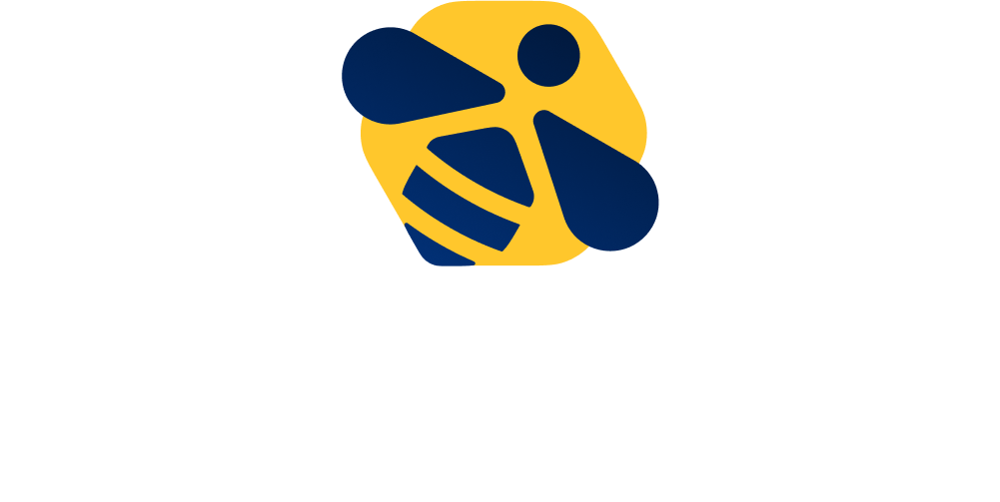

# 2024

## Winerump 2024 - La belle saison - 06/09/2024

## Slides des rumps

[Blind ROPing like it's the 90's	- Damien](./%231_Damien.pdf)

[RS-Shell: a rusty reverse shell for all the family - BlackWasp](./%232_BlackWasp_RS-Shell.pdf)

[DLHell : L'enfer du remote DLL Hijack via DCOM - Kevin Tellier](./%233_Kevin_Tellier.pdf)

[Recherche de patterns en représentation intermédiaire appliquée aux malwares - Pierre-Henri Pezier](./%234_PH_Pezier.pdf)

[GitHub API, your mistakes belong to us!	- Frederick Kaludis](./%235_Frederick_Kaludis.pdf)

[Using n-day to break kirin's secureboot for fun and profit - Oscar Azzopardi](./%236_Oscar_Azzopardi.pdf)

[Is port stealing {still|really} exploitable in 2024 ? - Thierry Meyer](./%237_Thierry_Meyer.pdf)

[Time Travel Analysis VS Debuggers - Pierre Mondon](./%238_Pierre_Mondon.pdf)

## Sponsors

Cette édition à été sponsorisé par :

### Randorisec

### Synacktiv

### Strangebee

### Fenrisk

### HarfangLab

### KnockKnock

### Lexfo

