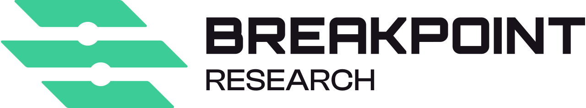
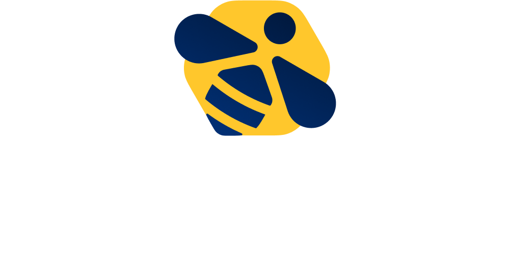

# 2026

## Winerump 2026 - La belle saison - 11/09/2026

## Programme

Le programme sera publié prochainement !

## Sponsors

Cette édition est sponsorisée par :

### Breakpoint Research

Breakpoint Research is a worldwide, fully remote company specializing in cutting edge research and real world exploit development

### Epsilon

@epsilon_sec est une entreprise européenne de sécurité qui se spécialise dans la recherche de vulnérabilités et le développement d'exploits sur mobile (iOS / Android).

### Liniom

Cabinet indépendant certifié ISO/IEC 27001, Liniom accompagne depuis 2005 les organisations dans leurs enjeux de cybersécurité. Notre expertise associe conseil, audit et cybersécurité opérationnelle au service de solutions pragmatiques.

### Randorisec

Fondée en 2015 par des experts en sécurité des systèmes d’information, RandoriSec propose les services suivants:

- Tests d'intrusion et audits de sécurité
- Rétro ingénierie et recherche de vulnérabilités
- Audit et analyses inforensiques de plateformes mobiles

### Strangebee

@StrangeBee développe TheHive, une plateforme collaborative de gestion des incidents de sécurité, utilisée par des équipes SOC, CERT et CSIRT dans le monde entier. Elle compte 80 collaborateurs et +200 clients dans 50 pays.

### Synacktiv

Synacktiv est une société spécialisée en sécurité offensive. Pentest, reverse-engineering, réponse à incident et développement d’outils offensifs sont leur cœur de métier. Ils sont présents à Paris, Toulouse, Rennes, Lille, Lyon et Bordeaux.

